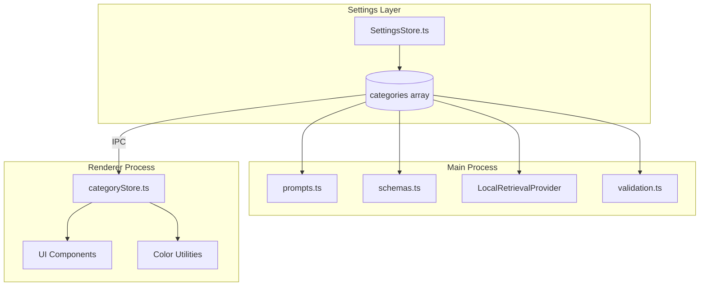

# Customizable Activity Categories

## Current State Analysis

Categories are currently hardcoded across the codebase in these locations:

**Type Definitions (must be made dynamic):**

- [`src/lib/dayline.ts`](src/lib/dayline.ts) - `ActivityCategory` type + `CATEGORY_RGB` colors
- [`src/types/index.ts`](src/types/index.ts) - `AutomationCategory` type
- [`electron/shared/types.ts`](electron/shared/types.ts) - `AutomationCategory` + `ClassificationResult.category`
- [`electron/main/features/ai/providers/LocalRetrievalProvider.ts`](electron/main/features/ai/providers/LocalRetrievalProvider.ts) - `Label` type

**Color Mappings (4 different formats):**

- `src/lib/dayline.ts` - RGB arrays for dayline visualization
- `src/lib/utils.ts` - `getCategoryColor()` - Tailwind classes
- `src/components/story/StatsChart.tsx` - Hex colors
- `src/components/timeline/EventCard.tsx` - `getCategoryOverlayColor()` - Tailwind overlay classes

**LLM Prompts:**

- [`electron/main/features/llm/prompts.ts`](electron/main/features/llm/prompts.ts) - Hardcoded category descriptions
- [`electron/main/features/llm/schemas.ts`](electron/main/features/llm/schemas.ts) - Zod enum validation

**UI Components:**

- [`src/components/timeline/TimelineFilters.tsx`](src/components/timeline/TimelineFilters.tsx) - `CATEGORIES` array, `CATEGORY_ICON` mapping
- [`src/components/settings/AutomationTab.tsx`](src/components/settings/AutomationTab.tsx) - `CATEGORIES` array

**Validation:**

- [`electron/main/infra/settings/SettingsStore.ts`](electron/main/infra/settings/SettingsStore.ts) - Zod category enum
- [`electron/main/ipc/validation.ts`](electron/main/ipc/validation.ts) - Zod category enum

---

## Data Model

### New Category Interface

```typescript
interface CategoryDefinition {
  id: string;           // unique identifier (slug-like, e.g., "work", "deep-focus")
  name: string;         // display name (e.g., "Work", "Deep Focus")
  color: string;        // hex color (e.g., "#22C55E")
  icon: string;         // lucide icon name (e.g., "Briefcase", "BookOpen")
  description: string;  // LLM prompt description for classification
  order: number;        // display order
  isSystem?: boolean;   // true for "Unknown" only
}
```

### Default Categories (migrated from current)

| ID | Name | Color | Icon | Description |

|----|------|-------|------|-------------|

| study | Study | #3B82F6 | BookOpen | Learning, courses, reading educational content, research |

| work | Work | #22C55E | Briefcase | Professional tasks, coding, emails, documents, meetings |

| leisure | Leisure | #A855F7 | Gamepad2 | Entertainment, games, social media scrolling, videos |

| chores | Chores | #F97316 | Home | Personal admin, bills, shopping, scheduling |

| social | Social | #EC4899 | Users | Communication, messaging, calls |

| unknown | Unknown | #6B7280 | HelpCircle | Cannot determine (system, immutable) |

---

## Architecture



---

## Implementation Steps

### Phase 1: Core Data Model

1. **Add `CategoryDefinition` interface to shared types**

   - Update [`electron/shared/types.ts`](electron/shared/types.ts)
   - Add to `Settings` interface as `categories: CategoryDefinition[]`

2. **Update SettingsStore with default categories**

   - Modify [`electron/main/infra/settings/SettingsStore.ts`](electron/main/infra/settings/SettingsStore.ts)
   - Add Zod schema for category validation
   - Include migration logic for existing settings (auto-add defaults)

3. **Create category helper module**

   - New file: `electron/main/infra/categories.ts`
   - Functions: `getCategories()`, `getCategoryById()`, `getCategoryIds()`, `isValidCategory()`

### Phase 2: LLM Integration

4. **Dynamic prompt generation**

   - Update [`electron/main/features/llm/prompts.ts`](electron/main/features/llm/prompts.ts)
   - `buildSystemPromptStage1()` and `buildSystemPromptStage1TextOnly()` read categories from settings
   - Format user-defined descriptions into the prompt

5. **Dynamic Zod schema**

   - Update [`electron/main/features/llm/schemas.ts`](electron/main/features/llm/schemas.ts)
   - Create factory function: `buildClassificationSchema(categoryIds: string[])`
   - Accept any category ID from the user's list + "Unknown" fallback

6. **Update LocalRetrievalProvider**

   - Modify [`electron/main/features/ai/providers/LocalRetrievalProvider.ts`](electron/main/features/ai/providers/LocalRetrievalProvider.ts)
   - Use dynamic category list instead of hardcoded `Label` type

### Phase 3: Validation Layer

7. **Update IPC validation**

   - Modify [`electron/main/ipc/validation.ts`](electron/main/ipc/validation.ts)
   - Make category validation accept any string (validation happens at classification time)
   - Or dynamically build schemas based on current settings

8. **Update automation rules validation**

   - Both in `SettingsStore.ts` and `validation.ts`
   - Accept dynamic category values

### Phase 4: Frontend - Core

9. **Create category context/store**

   - New file: `src/stores/categories.ts` (or extend app store)
   - Load categories from settings on init
   - Expose: categories array, color utilities, icon utilities

10. **Unified color utility**

    - Update [`src/lib/dayline.ts`](src/lib/dayline.ts) - make `CATEGORY_RGB` dynamic
    - Update [`src/lib/utils.ts`](src/lib/utils.ts) - `getCategoryColor()` uses category store
    - Derive all color formats (RGB, hex, Tailwind) from the single hex color source

### Phase 5: Frontend - UI Updates

11. **Update visualization components**

    - [`src/components/story/StatsChart.tsx`](src/components/story/StatsChart.tsx) - use dynamic colors
    - [`src/components/visualization/DaylineChart.tsx`](src/components/visualization/DaylineChart.tsx) - use dynamic colors
    - [`src/components/timeline/EventCard.tsx`](src/components/timeline/EventCard.tsx) - update `getCategoryOverlayColor()`

12. **Update filter components**

    - [`src/components/timeline/TimelineFilters.tsx`](src/components/timeline/TimelineFilters.tsx) - dynamic `CATEGORY_OPTIONS`
    - [`src/components/settings/AutomationTab.tsx`](src/components/settings/AutomationTab.tsx) - dynamic `CATEGORIES`

### Phase 6: Category Management UI

13. **Create category editor component**

    - New file: `src/components/settings/CategoriesTab.tsx`
    - List of categories with drag-to-reorder
    - Add/Edit/Delete functionality
    - Color picker (hex input + palette)
    - Icon picker (curated set of ~30 lucide icons)
    - Description textarea for LLM prompt

14. **Add to settings view**

    - Update [`src/components/settings/SettingsView.tsx`](src/components/settings/SettingsView.tsx)
    - Add new "Categories" tab

---

## Migration Strategy

- **Settings migration**: If `categories` is undefined in settings file, populate with default categories
- **Existing events**: No migration needed - categories are stored as TEXT strings
- **Backwards compatibility**: `toCategory()` function returns "Unknown" for unrecognized categories

---

## Icon Picker - Curated Set

Suggested lucide icons for the picker:

```
Briefcase, BookOpen, Gamepad2, Home, Users, HelpCircle,
Code, Coffee, Dumbbell, Heart, Lightbulb, Music,
Palette, Pencil, Phone, PiggyBank, Plane, Rocket,
ShoppingCart, Sparkles, Star, Sun, Target, Timer,
Tv, Utensils, Video, Wallet, Wrench, Zap
```

---

## Files to Create

| File | Purpose |

|------|---------|

| `electron/main/infra/categories.ts` | Category utilities for main process |

| `src/stores/categories.ts` | Category store for frontend |

| `src/components/settings/CategoriesTab.tsx` | Category management UI |

| `src/components/ui/icon-picker.tsx` | Icon picker component |

| `src/components/ui/color-picker.tsx` | Color picker component |

## Files to Modify

| File | Changes |

|------|---------|

| `electron/shared/types.ts` | Add `CategoryDefinition`, update `Settings` |

| `electron/main/infra/settings/SettingsStore.ts` | Add category schema, defaults, migration |

| `electron/main/features/llm/prompts.ts` | Dynamic category descriptions |

| `electron/main/features/llm/schemas.ts` | Dynamic Zod schema |

| `electron/main/ipc/validation.ts` | Dynamic category validation |

| `src/lib/dayline.ts` | Dynamic `CATEGORY_RGB`, update `toCategory()` |

| `src/lib/utils.ts` | Dynamic `getCategoryColor()` |

| `src/components/timeline/TimelineFilters.tsx` | Dynamic categories |

| `src/components/timeline/EventCard.tsx` | Dynamic overlay colors |

| `src/components/settings/AutomationTab.tsx` | Dynamic categories |

| `src/components/story/StatsChart.tsx` | Dynamic colors |

| `src/types/index.ts` | Re-export category types |